# 일년내내 산타랠리 - 2025-12-10

**금일의 시장현황**: 오늘은 다소 **조정이 있는 차가운 하루**였습니다. ❄️

## 📉 한미반도체 (042700.KS)

**현재가**: 121,100원 (-200, -0.16%)
**시장의 변화 (Sentiment)**: 매우 부정적 (Strong Sell Sentiment)
> *20일 이동평균선 하회, 전일 대비 하락 (-0.16%), 음봉 마감*

### 일봉 차트
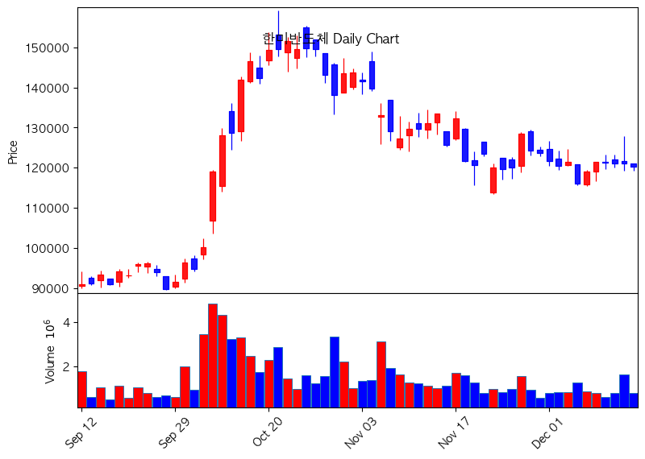

### 금일 시가/종가 등락 변화

---

## 📉 제주반도체 (080220.KS)

**현재가**: 19,020원 (-220, -1.14%)
**시장의 변화 (Sentiment)**: 매우 부정적 (Strong Sell Sentiment)
> *20일 이동평균선 하회, 전일 대비 하락 (-1.14%), 음봉 마감*

### 일봉 차트
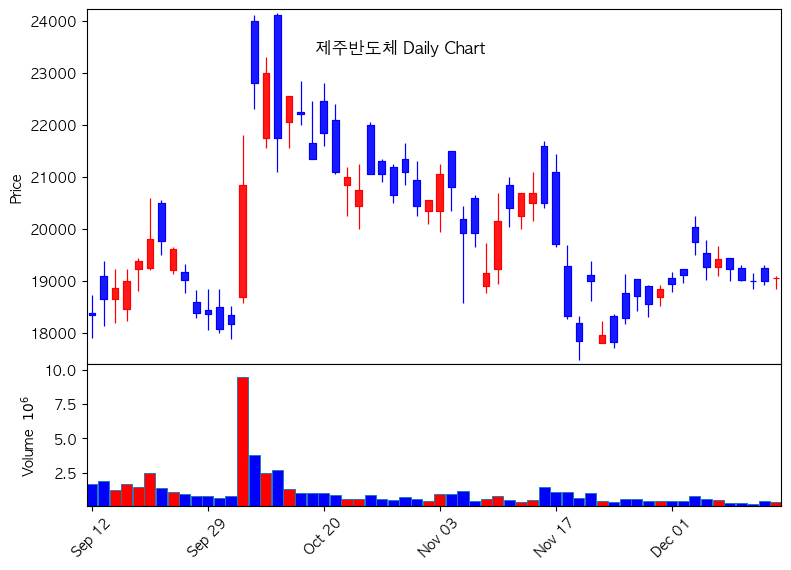

### 금일 시가/종가 등락 변화
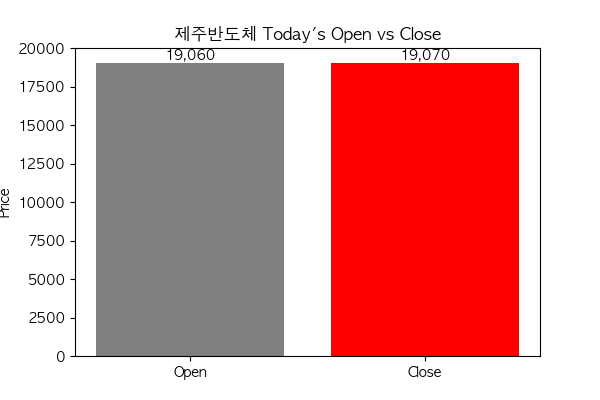

---

## 📉 LS머트리얼즈 (417200.KQ)

**현재가**: 11,980원 (-130, -1.07%)
**시장의 변화 (Sentiment)**: 매우 부정적 (Strong Sell Sentiment)
> *20일 이동평균선 하회, 전일 대비 하락 (-1.07%), 음봉 마감*

### 일봉 차트
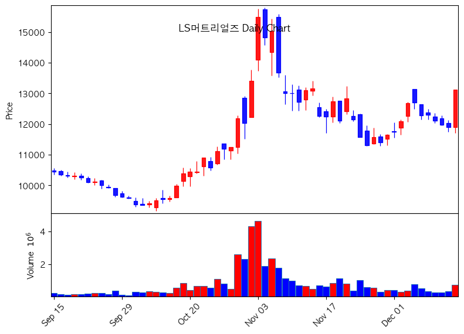

### 금일 시가/종가 등락 변화
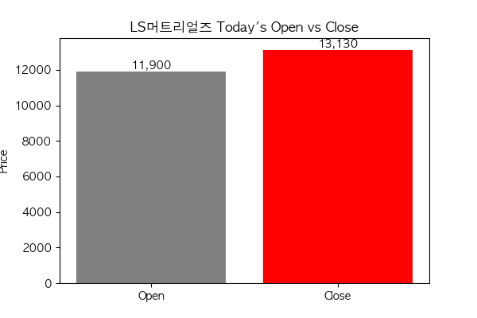

---

## 📉 엘엔에프 (066970.KS)

**현재가**: 127,100원 (-5,200, -3.93%)
**시장의 변화 (Sentiment)**: 중립 (Neutral)
> *20일 이동평균선 상회, 전일 대비 하락 (-3.93%), 음봉 마감*

### 일봉 차트
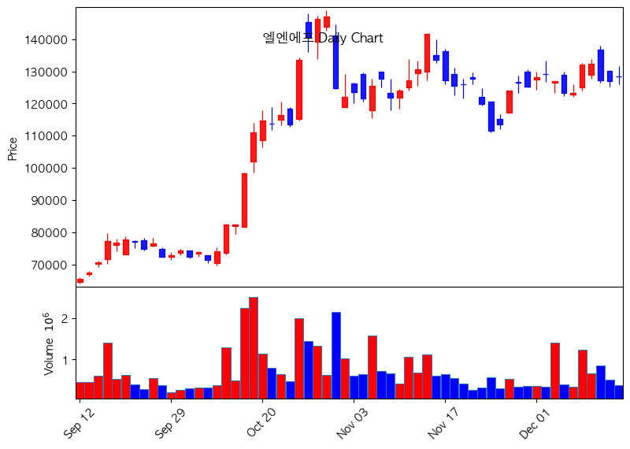

### 금일 시가/종가 등락 변화

---

## 📉 한국콜마 (161890.KS)

**현재가**: 64,400원 (-1,000, -1.53%)
**시장의 변화 (Sentiment)**: 매우 부정적 (Strong Sell Sentiment)
> *20일 이동평균선 하회, 전일 대비 하락 (-1.53%), 음봉 마감*

### 일봉 차트
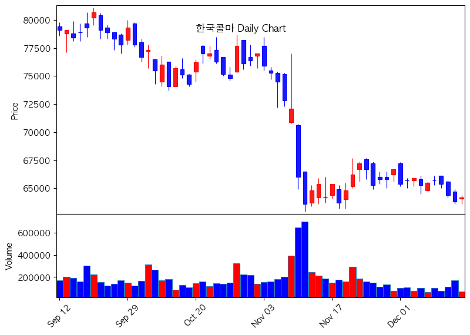

### 금일 시가/종가 등락 변화
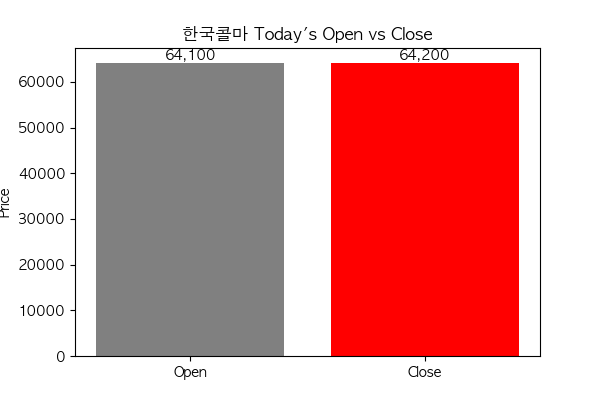

---

## 📉 진에어 (272450.KS)

**현재가**: 6,830원 (-140, -2.01%)
**시장의 변화 (Sentiment)**: 중립 (Neutral)
> *20일 이동평균선 상회, 전일 대비 하락 (-2.01%), 음봉 마감*

### 일봉 차트
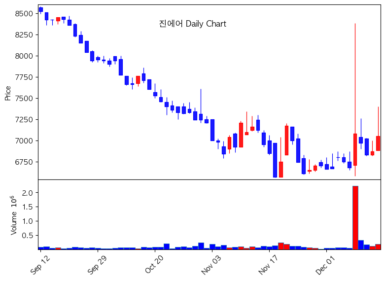

### 금일 시가/종가 등락 변화
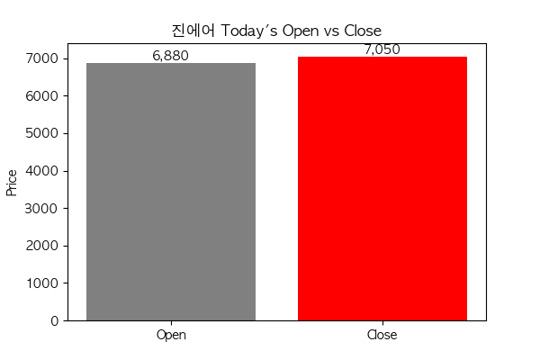

---

## 📉 가온칩스 (399720.KQ)

**현재가**: 48,700원 (-1,700, -3.37%)
**시장의 변화 (Sentiment)**: 중립 (Neutral)
> *20일 이동평균선 상회, 전일 대비 하락 (-3.37%), 음봉 마감*

### 일봉 차트
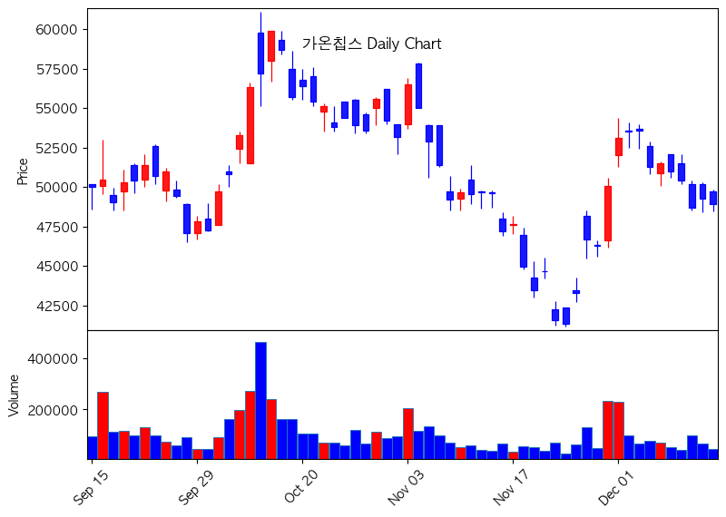

### 금일 시가/종가 등락 변화

---

## 📉 두산테스나 (131970.KQ)

**현재가**: 43,000원 (-450, -1.04%)
**시장의 변화 (Sentiment)**: 매우 부정적 (Strong Sell Sentiment)
> *20일 이동평균선 하회, 전일 대비 하락 (-1.04%), 음봉 마감*

### 일봉 차트
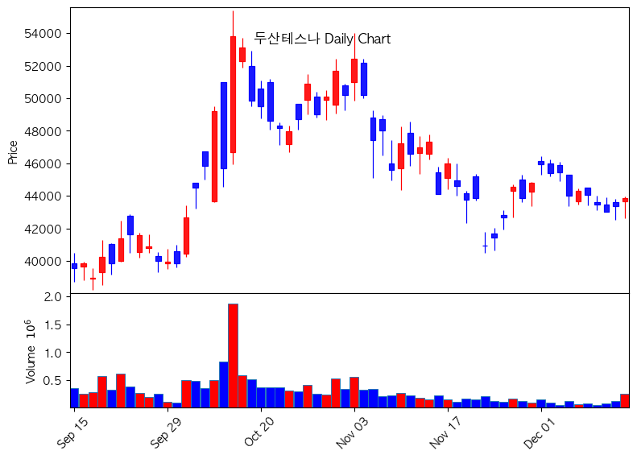

### 금일 시가/종가 등락 변화
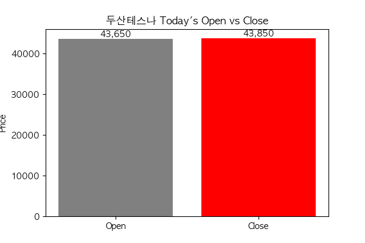

---

## 📉 나노신소재 (121600.KQ)

**현재가**: 60,300원 (-100, -0.17%)
**시장의 변화 (Sentiment)**: 중립 (Neutral)
> *20일 이동평균선 상회, 전일 대비 하락 (-0.17%), 음봉 마감*

### 일봉 차트
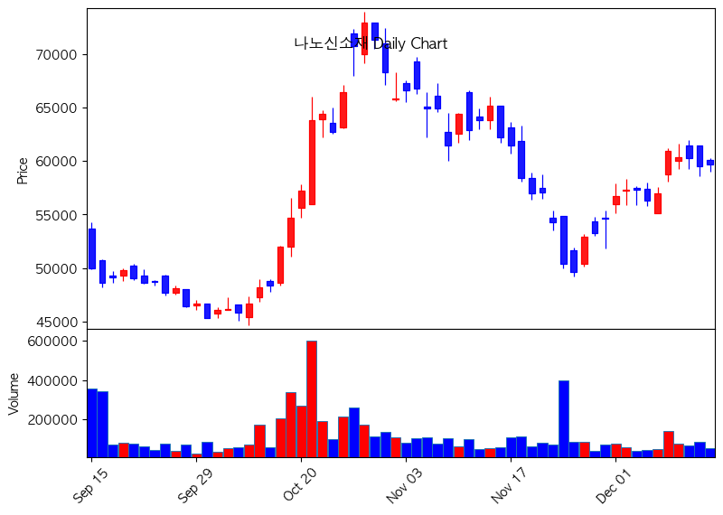

### 금일 시가/종가 등락 변화
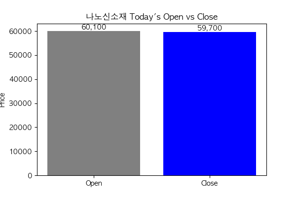

---

## 📈 더블유씨피 (393890.KQ)

**현재가**: 7,890원 (+390, +5.20%)
**시장의 변화 (Sentiment)**: 매우 긍정적 (Strong Buy Sentiment)
> *20일 이동평균선 상회, 전일 대비 상승 (5.20%), 음봉 마감*

### 일봉 차트
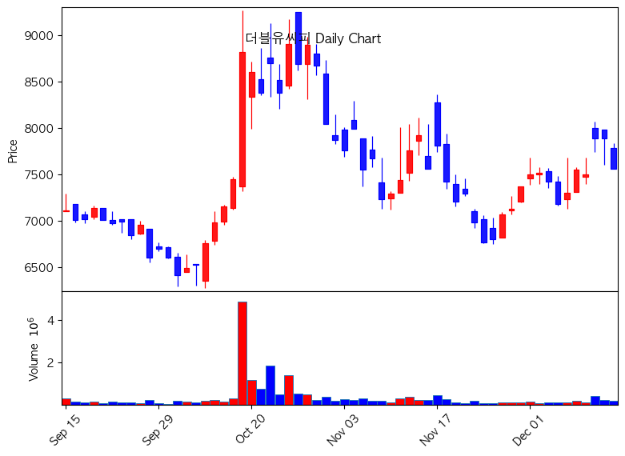

### 금일 시가/종가 등락 변화

---

## 📉 퀄리타스반도체 (432720.KQ)

**현재가**: 13,680원 (-140, -1.01%)
**시장의 변화 (Sentiment)**: 매우 부정적 (Strong Sell Sentiment)
> *20일 이동평균선 하회, 전일 대비 하락 (-1.01%), 음봉 마감*

### 일봉 차트
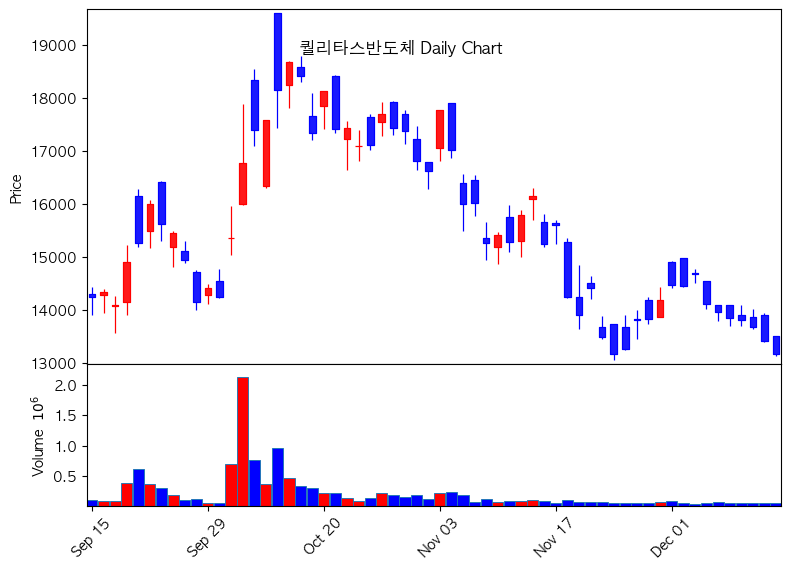

### 금일 시가/종가 등락 변화
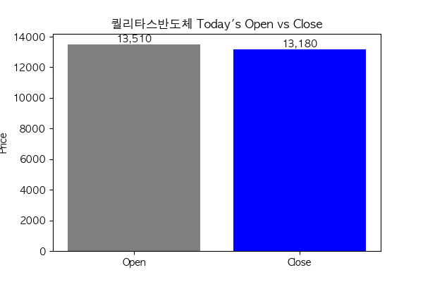

---

## 📈 칩스앤미디어 (094360.KQ)

**현재가**: 18,720원 (+230, +1.24%)
**시장의 변화 (Sentiment)**: 매우 긍정적 (Strong Buy Sentiment)
> *20일 이동평균선 상회, 전일 대비 상승 (1.24%), 음봉 마감*

### 일봉 차트
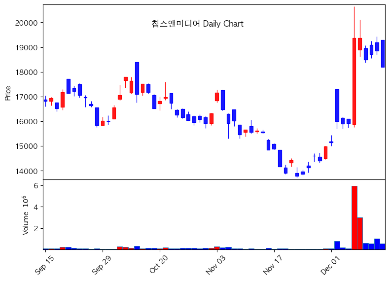

### 금일 시가/종가 등락 변화
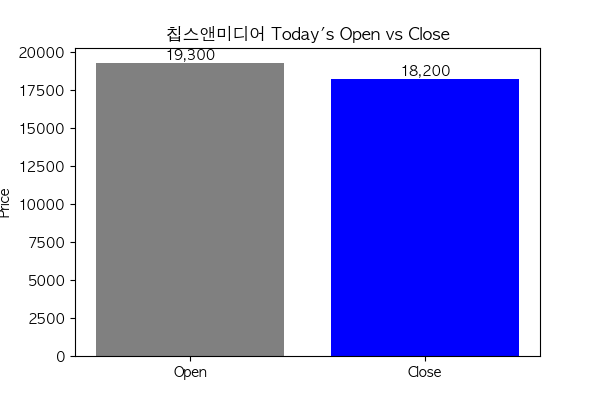

---

## 📉 오픈엣지테크놀로지 (394280.KQ)

**현재가**: 12,670원 (-120, -0.94%)
**시장의 변화 (Sentiment)**: 중립 (Neutral)
> *20일 이동평균선 상회, 전일 대비 하락 (-0.94%), 음봉 마감*

### 일봉 차트
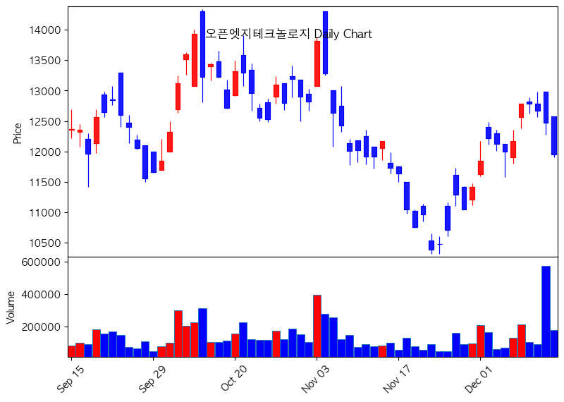

### 금일 시가/종가 등락 변화
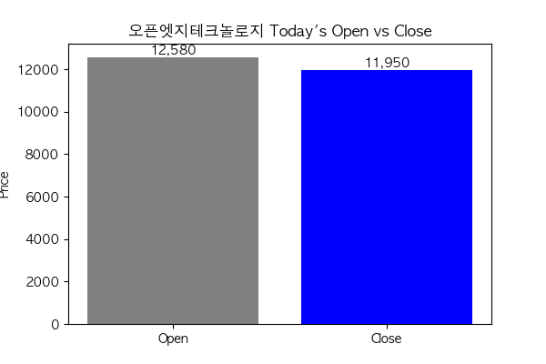

---

## 📉 제이오 (418550.KQ)

**현재가**: 7,720원 (-330, -4.10%)
**시장의 변화 (Sentiment)**: 중립 (Neutral)
> *20일 이동평균선 상회, 전일 대비 하락 (-4.10%), 음봉 마감*

### 일봉 차트
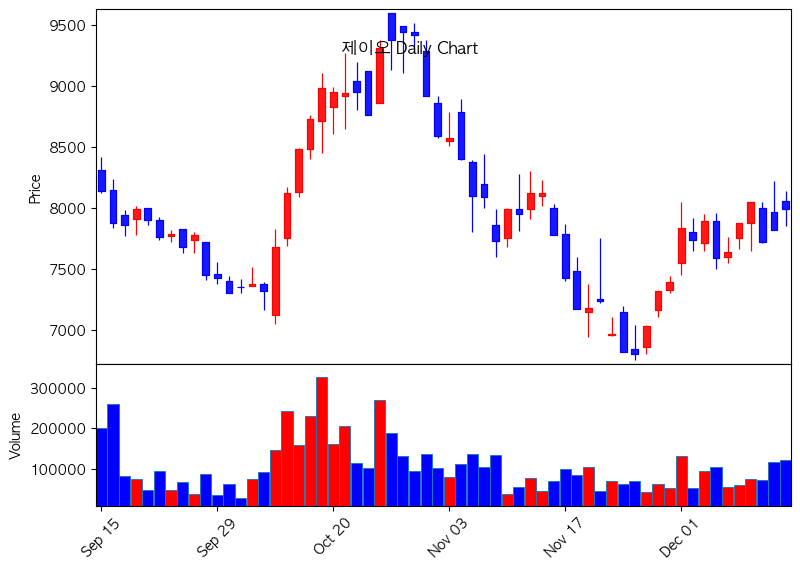

### 금일 시가/종가 등락 변화
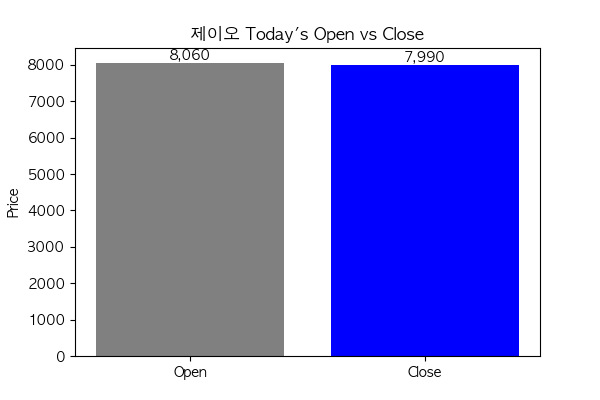

---

## 📈 픽셀플러스 (087600.KQ)

**현재가**: 5,960원 (+80, +1.36%)
**시장의 변화 (Sentiment)**: 매우 긍정적 (Strong Buy Sentiment)
> *20일 이동평균선 상회, 전일 대비 상승 (1.36%), 양봉 마감*

### 일봉 차트
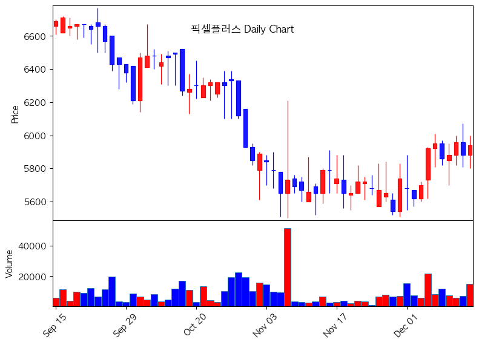

### 금일 시가/종가 등락 변화
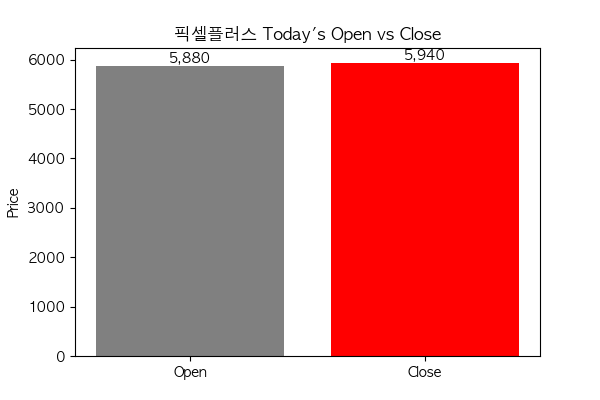

---

## 📉 KH바텍 (060720.KQ)

**현재가**: 11,620원 (+0, +0.00%)
**시장의 변화 (Sentiment)**: 중립 (Neutral)
> *20일 이동평균선 상회, 전일 대비 하락 (0.00%), 양봉 마감*

### 일봉 차트
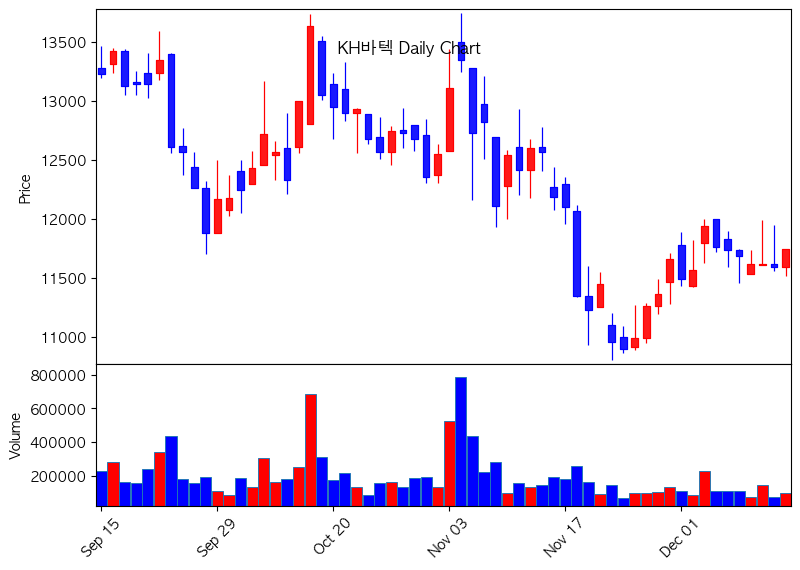

### 금일 시가/종가 등락 변화

---

## 📉 씨이랩 (189330.KQ)

**현재가**: 4,735원 (-15, -0.32%)
**시장의 변화 (Sentiment)**: 중립 (Neutral)
> *20일 이동평균선 상회, 전일 대비 하락 (-0.32%), 음봉 마감*

### 일봉 차트
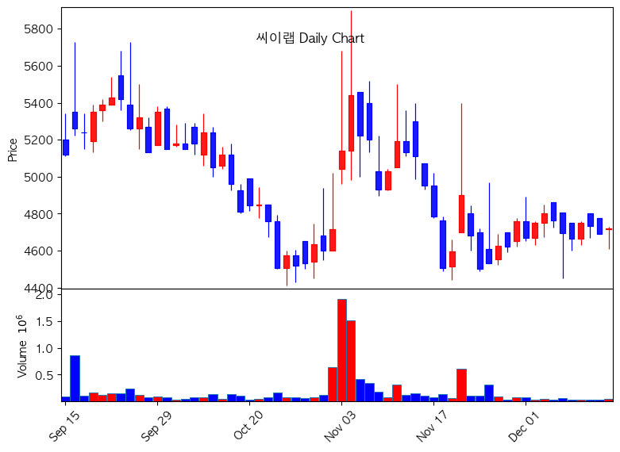

### 금일 시가/종가 등락 변화
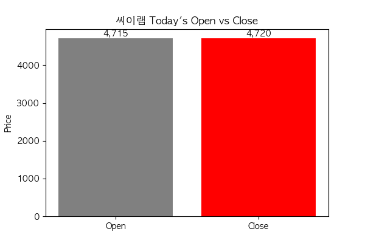

---

## 📉 모두투어 (080160.KQ)

**현재가**: 10,240원 (-10, -0.10%)
**시장의 변화 (Sentiment)**: 매우 부정적 (Strong Sell Sentiment)
> *20일 이동평균선 하회, 전일 대비 하락 (-0.10%), 음봉 마감*

### 일봉 차트
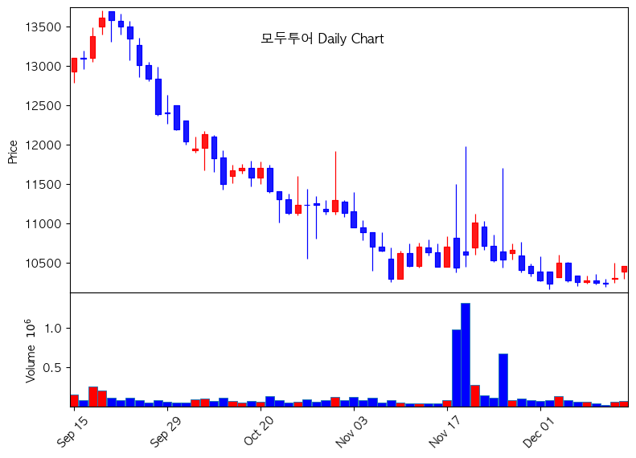

### 금일 시가/종가 등락 변화

---

## 📉 서린바이오 (038070.KQ)

**현재가**: 6,760원 (-60, -0.88%)
**시장의 변화 (Sentiment)**: 중립 (Neutral)
> *20일 이동평균선 상회, 전일 대비 하락 (-0.88%), 음봉 마감*

### 일봉 차트
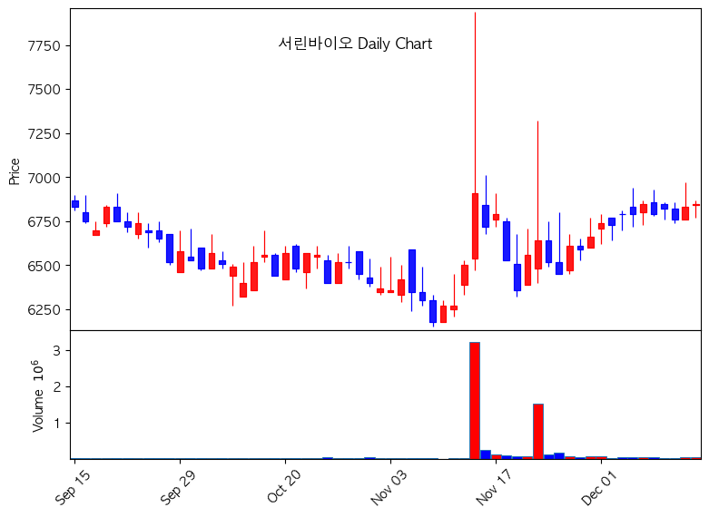

### 금일 시가/종가 등락 변화

---

## 📉 HPSP (403870.KQ)

**현재가**: 29,650원 (-450, -1.50%)
**시장의 변화 (Sentiment)**: 매우 부정적 (Strong Sell Sentiment)
> *20일 이동평균선 하회, 전일 대비 하락 (-1.50%), 음봉 마감*

### 일봉 차트
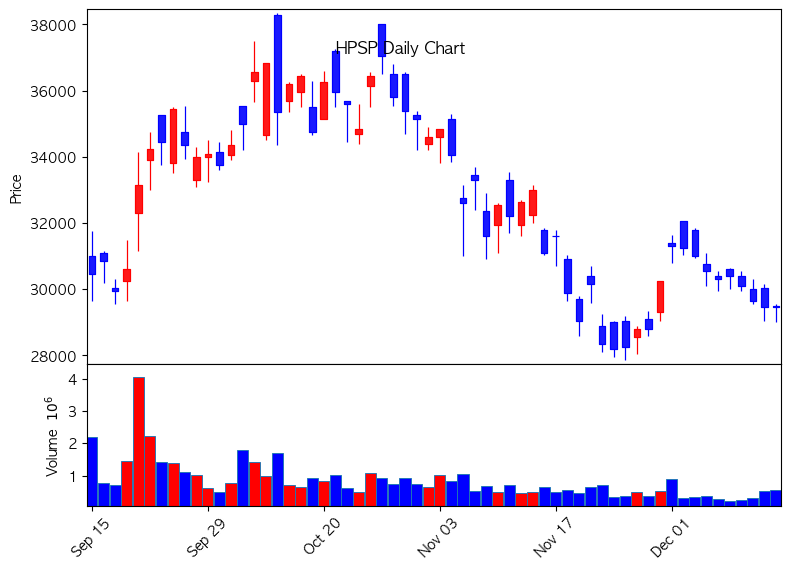

### 금일 시가/종가 등락 변화

---

## 📈 오로스테크놀로지 (322310.KQ)

**현재가**: 22,850원 (+100, +0.44%)
**시장의 변화 (Sentiment)**: 중립 (Neutral)
> *20일 이동평균선 하회, 전일 대비 상승 (0.44%), 음봉 마감*

### 일봉 차트
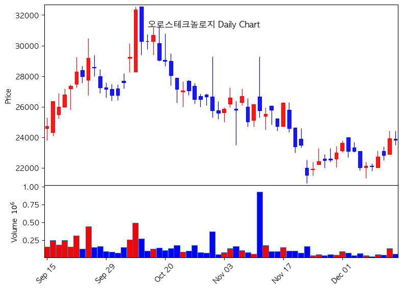

### 금일 시가/종가 등락 변화
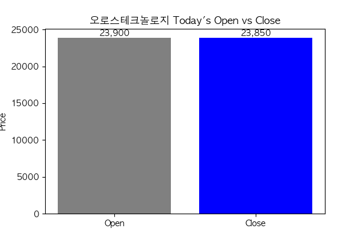

---

## 📉 루닛 (328130.KQ)

**현재가**: 37,100원 (-400, -1.07%)
**시장의 변화 (Sentiment)**: 매우 부정적 (Strong Sell Sentiment)
> *20일 이동평균선 하회, 전일 대비 하락 (-1.07%), 음봉 마감*

### 일봉 차트
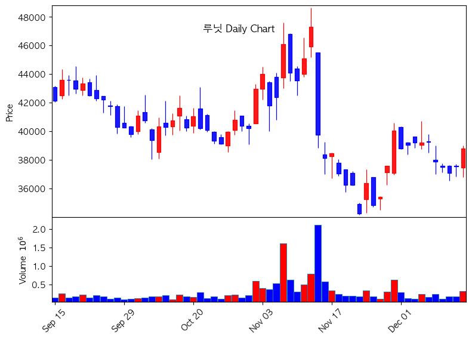

### 금일 시가/종가 등락 변화
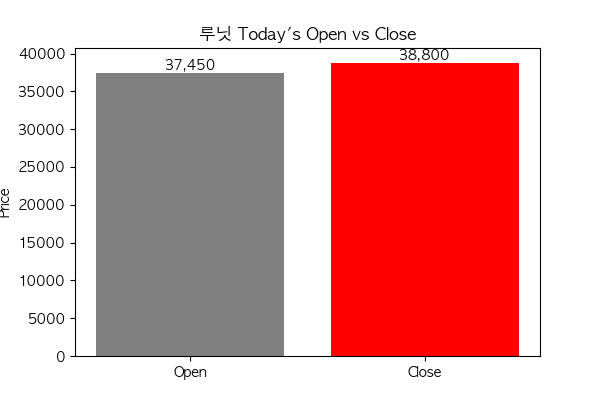

---

## 📈 뷰노 (338220.KQ)

**현재가**: 24,450원 (+150, +0.62%)
**시장의 변화 (Sentiment)**: 매우 긍정적 (Strong Buy Sentiment)
> *20일 이동평균선 상회, 전일 대비 상승 (0.62%), 음봉 마감*

### 일봉 차트
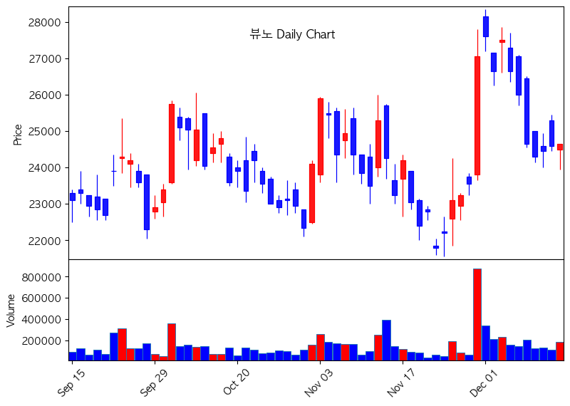

### 금일 시가/종가 등락 변화
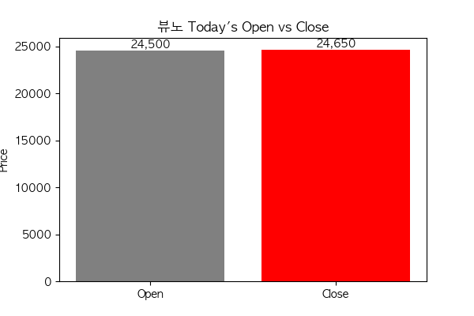

---

## 📈 제이엘케이 (322510.KQ)

**현재가**: 4,330원 (+255, +6.26%)
**시장의 변화 (Sentiment)**: 중립 (Neutral)
> *20일 이동평균선 하회, 전일 대비 상승 (6.26%), 양봉 마감*

### 일봉 차트
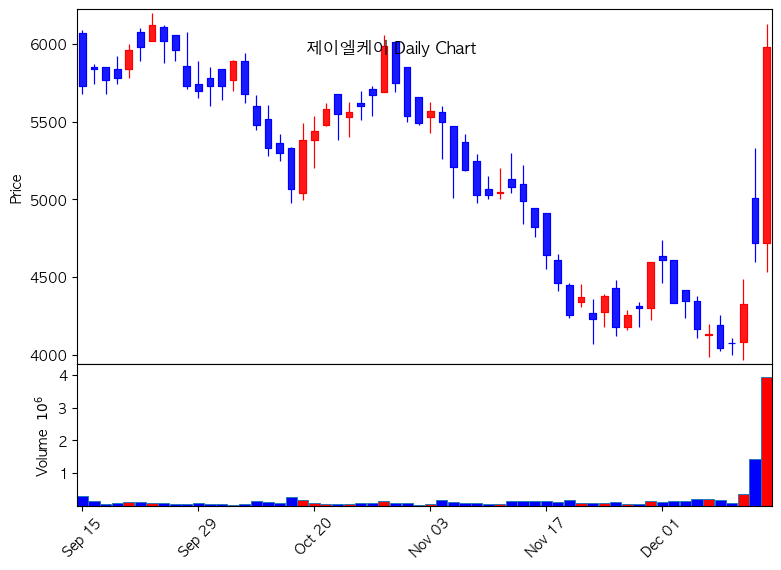

### 금일 시가/종가 등락 변화
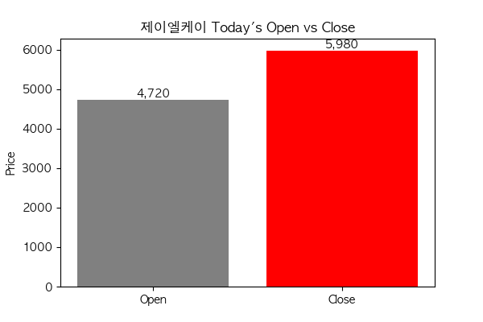

---

## 📈 딥노이드 (315640.KQ)

**현재가**: 3,695원 (+40, +1.09%)
**시장의 변화 (Sentiment)**: 중립 (Neutral)
> *20일 이동평균선 하회, 전일 대비 상승 (1.09%), 양봉 마감*

### 일봉 차트
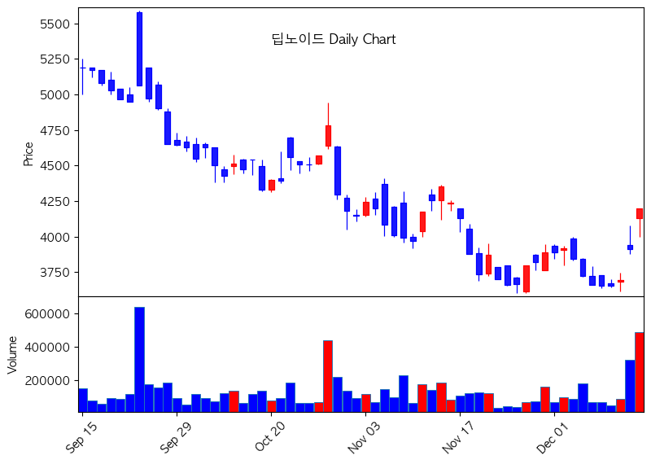

### 금일 시가/종가 등락 변화
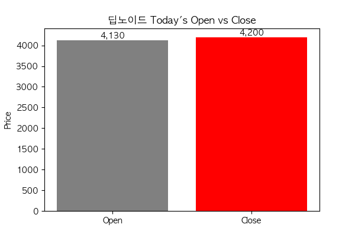

---

## 📈 코어라인소프트 (384470.KQ)

**현재가**: 3,765원 (+110, +3.01%)
**시장의 변화 (Sentiment)**: 매우 긍정적 (Strong Buy Sentiment)
> *20일 이동평균선 상회, 전일 대비 상승 (3.01%), 양봉 마감*

### 일봉 차트
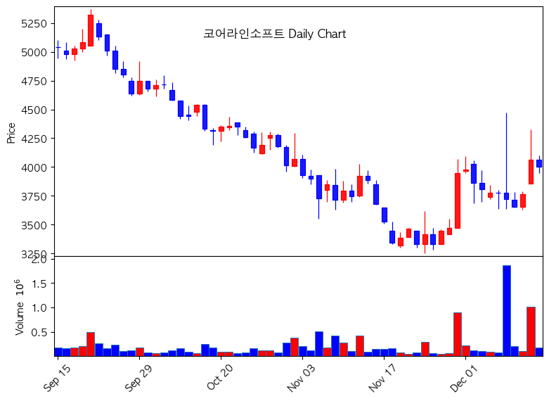

### 금일 시가/종가 등락 변화

---
