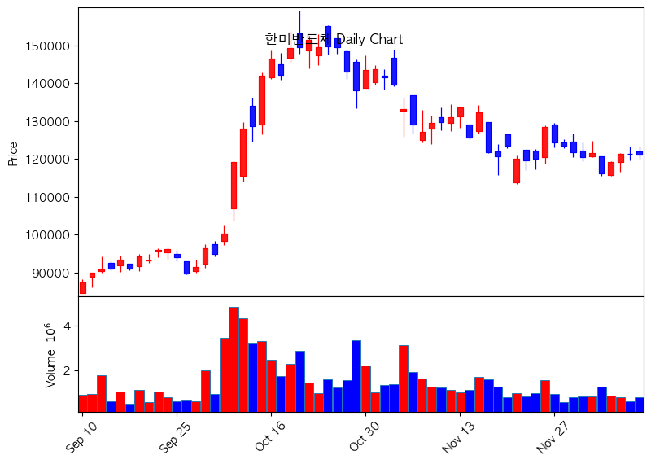
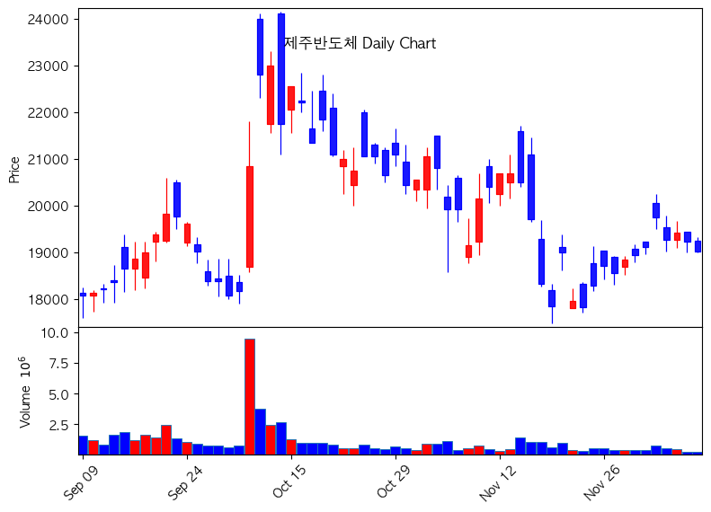
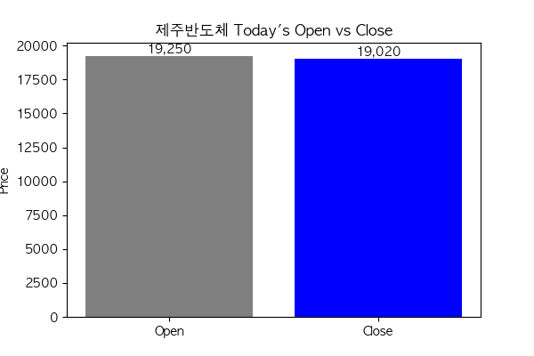

# 일년내내 산타랠리 - 2025-12-09

**금일의 시장현황**: 오늘은 다소 **조정이 있는 차가운 하루**였습니다. ❄️

## 📉 한미반도체 (042700.KS)

**현재가**: 121,300원 (-100, -0.08%)
**시장의 변화 (Sentiment)**: 매우 부정적 (Strong Sell Sentiment)
> *20일 이동평균선 하회, 전일 대비 하락 (-0.08%), 음봉 마감*

### 일봉 차트

### 금일 시가/종가 등락 변화

---

## 📉 제주반도체 (080220.KS)

**현재가**: 19,240원 (-180, -0.93%)
**시장의 변화 (Sentiment)**: 중립 (Neutral)
> *20일 이동평균선 상회, 전일 대비 하락 (-0.93%), 음봉 마감*

### 일봉 차트

### 금일 시가/종가 등락 변화

---
